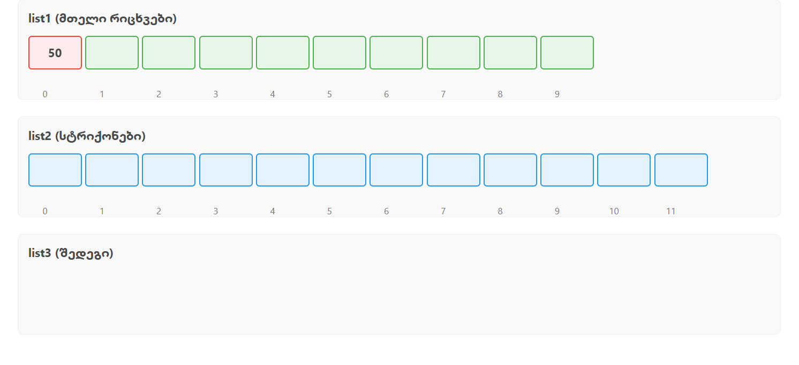

# List Processing Algorithm - Final Exam Task 1

## 📋 Overview

This Java program implements a **two-phase list processing algorithm** that transforms and filters data from two input lists according to specific rules.

## 🚀 Algorithm Description

### Phase 1: Transformation
1. **For each number `N` in `list1`:**
    - Calculate target index: `targetIndex = N + 1`
    - Access `list2[targetIndex]`
    - If valid: create `list2[targetIndex] + N`
    - If invalid: insert `"ERROR"`
2. **Build `list3`** with these transformed values

### Phase 2: Deletion
1. **Remove entries from `list3`** whose **indexes** appear in `list1`
2. **Keep only entries** at indexes **NOT mentioned** in `list1`

## 💻 Example Execution

```java
list1 = [10, 1, 9, 2, 5, 7, 6, 4, 8, 3]
list2 = ["iih", "kwy", "xmg", "ytr", "dky", "huw", "sqw", "yci", "pup", "gbl", "qbp", "wms"]
```

**Phase 1 Results:**
- `10` → `list2[11]` → `"wms10"`
- `1` → `list2[2]` → `"xmg1"`
- `9` → `list2[10]` → `"qbp9"`
- `2` → `list2[3]` → `"ytr2"`
- etc.

**Phase 2 Results:**
- Remove indexes: `[10, 1, 9, 2, 5, 7, 6, 4, 8, 3]`
- **Keep only index 0**: `"wms10"`

## ⚠️ Error Handling

### Scenario: Large Values in list1

When a value in `list1` exceeds the bounds of `list2`, the program handles it gracefully:

#### Example of Error Handling:


```java

list1 = [15, 2, 20]  // 15 and 20 are too large
list2 = ["a", "b", "c", "d"]  // size = 4, max valid index = 3

// Phase 1 transformation:
// 15 → list2[16] → INDEX OUT OF BOUNDS → "ERROR"
// 2 → list2[3] → "d2"
// 20 → list2[21] → INDEX OUT OF BOUNDS → "ERROR"

// list3 becomes: ["ERROR", "d2", "ERROR"]
```

### Error Handling Behavior:
- ✅ **No crashes or exceptions**
- ✅ **Graceful degradation** with "ERROR" markers
- ✅ **Program continues execution** normally
- ✅ **Consistent output format**

## 🔧 Technical Details


### Key Features:
- **Robust bounds checking** prevents IndexOutOfBoundsException
- **Efficient deletion** using HashSet for O(1) lookup
- **Comprehensive JavaDoc** documentation
- **Null safety** with input validation

## 📊 Performance Characteristics

- **Time Complexity:** O(n + m) where n = list1.size(), m = list2.size()
- **Space Complexity:** O(n) for intermediate storage
- **Memory Efficient:** Uses HashSet for fast index lookups


*This implementation fulfills all requirements of the Object-Oriented Programming Final Exam Task 1.*